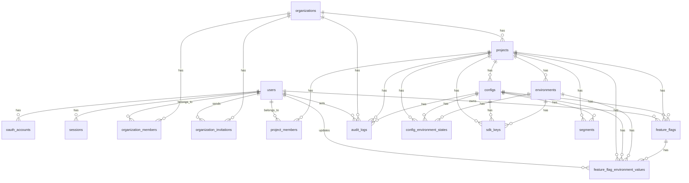

# Data Model - Capture Flag

## Objetivo

Documentar o modelo relacional inicial do Capture Flag, suas relacoes, constraints e decisoes de modelagem.

Este documento cobre o modelo necessario para o MVP: login, organizacoes, projetos, configs, ambientes, SDK keys, feature flags/settings, valores por ambiente, segmentos, advanced targeting, estado publicavel da config e audit minimo planejado.

## Estado Implementado

A migration inicial em `apps/api/prisma/migrations/000001_init/migration.sql` cobre a fundacao. Migrations posteriores incluem flags, valores por ambiente, audit logs e segmentos.

| Tabela | Estado |
|---|---|
| `users` | Implementada |
| `oauth_accounts` | Implementada |
| `sessions` | Implementada |
| `organizations` | Implementada |
| `organization_members` | Implementada |
| `projects` | Implementada |
| `project_members` | Implementada |
| `configs` | Implementada |
| `environments` | Implementada |
| `config_environment_states` | Implementada |
| `sdk_keys` | Implementada |
| `segments` | Implementada |
| `feature_flags` | Implementada |
| `feature_flag_environment_values` | Implementada |
| `audit_logs` | Implementada como audit minimo |

As validacoes de que `config_id` e `environment_id` pertencem ao mesmo `project_id` sao feitas pelos servicos da API e reforcadas por constraints compostas adicionadas na migration `000002_harden_phase1_constraints`.

## Convencoes

| Convencao | Decisao |
|---|---|
| Naming | Tabelas e colunas em `snake_case` |
| Primary keys | `uuid` em todas as tabelas |
| Datas | `created_at` e `updated_at` quando a entidade for mutavel |
| Soft delete | Usar colunas especificas como `revoked_at`, `accepted_at` e `deleted_at` quando fizer sentido |
| JSON | Usar `jsonb` para rules, percentage rollout, valores tipados e audit payloads no MVP |
| Tenant | Toda entidade operacional deve ser alcancavel a partir de uma `organization` |
| Secrets | Chaves e tokens devem ser armazenados como hash, nunca em texto puro |
| Advanced targeting | Prerequisites, arrays, datas e SemVer vivem em `rules_json`/`conditions_json`; nenhuma tabela nova e necessaria na Fase 7 |

## Invariantes Do Modelo

Estas regras fazem parte do modelo de dominio e devem ser preservadas pela API, migrations e UI.

| Invariante | Implicacao |
|---|---|
| Todo `Project` deve ter pelo menos uma `Config` | Ao criar um projeto, a API cria automaticamente uma config inicial com `key = default` |
| `Config` e obrigatoria para flags | `feature_flags.config_id` e sempre `NOT NULL` |
| `Config` e obrigatoria para SDK keys | `sdk_keys.config_id` e sempre `NOT NULL` |
| `Config` e obrigatoria para estado publicavel | `config_environment_states.config_id` e sempre `NOT NULL` |
| A ultima config de um projeto nao pode ser removida no MVP | Evita projeto sem unidade publicavel para SDKs |
| A UI pode esconder Config quando houver so uma | O modelo continua explicito sem adicionar complexidade para o usuario inicial |
| Boolean flag nao tem `enabled` separado | O estado ligado/desligado e o proprio `default_value` ou o valor servido por rule/rollout |

## Valores E Fallback

Existem dois conceitos diferentes de valor padrao.

| Conceito | Onde vive | Uso |
|---|---|---|
| `default_value` | Banco e Config JSON | Valor configurado no client para uma flag em um ambiente |
| `fallbackValue` | Chamada do SDK | Valor de emergencia informado pela aplicacao quando a flag nao pode ser avaliada |

Ordem de avaliacao esperada pelo SDK:

| Ordem | Resultado |
|---|---|
| 1 | Avaliar `rules_json` em ordem |
| 2 | Se nenhuma rule casar, avaliar `percentage_options_json` |
| 3 | Se rollout nao aplicar, retornar `default_value` |
| 4 | Se a config estiver indisponivel, invalida ou a flag nao existir, retornar `fallbackValue` informado pela aplicacao |

Prerequisite flags sao conditions dentro de `rules_json`. Elas referenciam outra flag pela key dentro da mesma config e sao avaliadas localmente no SDK. A API rejeita self-reference, referencias ausentes e ciclos no grafo de prerequisites do ambiente salvo.

## ERD MVP



## Tabelas MVP

### users

Representa a identidade principal de um usuario dentro da plataforma.

`users` nao deve ser acoplada a um provedor OAuth especifico. O mesmo usuario pode entrar com GitHub no MVP e vincular Google no futuro.

O email e opcional porque provedores OAuth podem nao retornar email confiavel ou publico. A identidade forte fica em `oauth_accounts(provider, provider_user_id)`.

| Coluna | Tipo | Obrigatorio | Observacao |
|---|---|---|---|
| id | uuid | sim | Primary key |
| name | text | sim | Nome exibido no client |
| email | text | nao | Email principal conhecido pela plataforma |
| avatar_url | text | nao | Avatar retornado pelo provedor OAuth |
| created_at | timestamp | sim | Data de criacao |
| updated_at | timestamp | sim | Data de atualizacao |

Constraints e indices:

| Tipo | Definicao |
|---|---|
| unique parcial | `email` where `email is not null` |

### oauth_accounts

Representa um vinculo entre um usuario da plataforma e uma conta externa de OAuth.

No MVP, o primeiro provedor sera GitHub. A separacao permite adicionar Google depois sem remodelar `users`.

| Coluna | Tipo | Obrigatorio | Observacao |
|---|---|---|---|
| id | uuid | sim | Primary key |
| user_id | uuid | sim | FK para `users.id` |
| provider | text | sim | Exemplo: `github` |
| provider_user_id | text | sim | ID estavel do usuario no provedor |
| provider_email | text | nao | Email retornado pelo provedor |
| created_at | timestamp | sim | Data de criacao |
| updated_at | timestamp | sim | Data de atualizacao |

Constraints e indices:

| Tipo | Definicao |
|---|---|
| unique | `(provider, provider_user_id)` |
| index | `user_id` |

### sessions

Representa uma sessao opaca usada pelo client com cookie HTTP-only.

O cookie armazena o token bruto. O banco armazena somente o hash do token.

| Coluna | Tipo | Obrigatorio | Observacao |
|---|---|---|---|
| id | uuid | sim | Primary key |
| user_id | uuid | sim | FK para `users.id` |
| token_hash | text | sim | Hash do token da sessao |
| expires_at | timestamp | sim | Expiracao da sessao |
| revoked_at | timestamp | nao | Revogacao manual/logout |
| created_at | timestamp | sim | Data de criacao |

Constraints e indices:

| Tipo | Definicao |
|---|---|
| unique | `token_hash` |
| index | `user_id` |
| index | `expires_at` |

### organizations

Representa o tenant principal da plataforma.

Uma organizacao possui varios usuarios e varios projetos.

| Coluna | Tipo | Obrigatorio | Observacao |
|---|---|---|---|
| id | uuid | sim | Primary key |
| name | text | sim | Nome exibido |
| slug | text | sim | Identificador legivel unico |
| created_at | timestamp | sim | Data de criacao |
| updated_at | timestamp | sim | Data de atualizacao |

Constraints e indices:

| Tipo | Definicao |
|---|---|
| unique | `slug` |

### organization_members

Representa o acesso de um usuario a uma organizacao e sua role organizacional.

Roles de organizacao sao usadas para administracao de alto nivel: membros, projetos e billing futuro.

| Coluna | Tipo | Obrigatorio | Observacao |
|---|---|---|---|
| id | uuid | sim | Primary key |
| organization_id | uuid | sim | FK para `organizations.id` |
| user_id | uuid | sim | FK para `users.id` |
| role | text | sim | `owner`, `admin`, `member`, `viewer` |
| created_at | timestamp | sim | Data de criacao |
| updated_at | timestamp | sim | Data de atualizacao |

Constraints e indices:

| Tipo | Definicao |
|---|---|
| unique | `(organization_id, user_id)` |
| index | `user_id` |

### organization_invitations

Representa convite por email para entrada em uma organizacao.

Esta tabela evita depender de usuario preexistente para adicionar membros.

| Coluna | Tipo | Obrigatorio | Observacao |
|---|---|---|---|
| id | uuid | sim | Primary key |
| organization_id | uuid | sim | FK para `organizations.id` |
| email | text | sim | Email convidado |
| role | text | sim | Role organizacional inicial |
| token_hash | text | sim | Hash do token do convite |
| invited_by_user_id | uuid | sim | FK para `users.id` |
| expires_at | timestamp | sim | Expiracao do convite |
| accepted_at | timestamp | nao | Quando foi aceito |
| revoked_at | timestamp | nao | Revogacao manual |
| created_at | timestamp | sim | Data de criacao |

Constraints e indices:

| Tipo | Definicao |
|---|---|
| unique | `token_hash` |
| unique parcial | `(organization_id, email)` where `accepted_at is null and revoked_at is null` |
| index | `invited_by_user_id` |
| index | `expires_at` |

### projects

Representa um produto, aplicacao ou sistema dentro de uma organizacao.

Projetos sao o limite funcional para configs, ambientes, membros do projeto e permissoes especificas.

| Coluna | Tipo | Obrigatorio | Observacao |
|---|---|---|---|
| id | uuid | sim | Primary key |
| organization_id | uuid | sim | FK para `organizations.id` |
| name | text | sim | Nome exibido |
| slug | text | sim | Identificador legivel dentro da organizacao |
| created_at | timestamp | sim | Data de criacao |
| updated_at | timestamp | sim | Data de atualizacao |

Constraints e indices:

| Tipo | Definicao |
|---|---|
| unique | `(organization_id, slug)` |
| unique auxiliar | `(id, organization_id)` para FKs compostas quando necessario |
| index | `organization_id` |

### configs

Representa um conjunto de flags/settings consumido como Config JSON por SDKs.

Um projeto pode ter varias configs, por exemplo `frontend-web`, `backend-api` e `mobile-app`. Cada par `config + environment` pode ter sua propria SDK key.

Ao criar um projeto, a aplicacao deve criar uma config inicial com `key = default` e `name = Default`. Essa config pode ser renomeada depois, mas a ultima config ativa de um projeto nao deve ser removida no MVP.

| Coluna | Tipo | Obrigatorio | Observacao |
|---|---|---|---|
| id | uuid | sim | Primary key |
| project_id | uuid | sim | FK para `projects.id` |
| key | text | sim | Identificador usado em URLs, SDK keys e APIs |
| name | text | sim | Nome exibido |
| description | text | nao | Descricao da config |
| created_at | timestamp | sim | Data de criacao |
| updated_at | timestamp | sim | Data de atualizacao |

Constraints e indices:

| Tipo | Definicao |
|---|---|
| unique | `(project_id, key)` |
| unique auxiliar | `(id, project_id)` para FKs compostas |
| index | `project_id` |

### project_members

Representa o acesso de um usuario a um projeto e sua role naquele projeto.

O mesmo usuario pode ter roles diferentes em projetos diferentes da mesma organizacao.

| Coluna | Tipo | Obrigatorio | Observacao |
|---|---|---|---|
| id | uuid | sim | Primary key |
| project_id | uuid | sim | FK para `projects.id` |
| user_id | uuid | sim | FK para `users.id` |
| role | text | sim | `project_admin`, `developer`, `viewer` |
| created_at | timestamp | sim | Data de criacao |
| updated_at | timestamp | sim | Data de atualizacao |

Constraints e indices:

| Tipo | Definicao |
|---|---|
| unique | `(project_id, user_id)` |
| index | `user_id` |

### environments

Representa um ambiente dentro de um projeto.

Exemplos: `development`, `staging`, `production`.

| Coluna | Tipo | Obrigatorio | Observacao |
|---|---|---|---|
| id | uuid | sim | Primary key |
| project_id | uuid | sim | FK para `projects.id` |
| name | text | sim | Nome exibido |
| key | text | sim | Identificador usado internamente/API |
| sort_order | integer | sim | Ordenacao no client |
| created_at | timestamp | sim | Data de criacao |
| updated_at | timestamp | sim | Data de atualizacao |

Constraints e indices:

| Tipo | Definicao |
|---|---|
| unique | `(project_id, key)` |
| unique auxiliar | `(id, project_id)` para FKs compostas |
| index | `project_id` |

### config_environment_states

Representa o estado publicavel atual de uma config em um ambiente.

No MVP, nao guarda historico. Ele existe para permitir `revision`, `etag` e cache HTTP desde o inicio. Historico, diff e rollback entram em `config_versions` no futuro.

| Coluna | Tipo | Obrigatorio | Observacao |
|---|---|---|---|
| id | uuid | sim | Primary key |
| project_id | uuid | sim | FK para `projects.id` |
| config_id | uuid | sim | FK para `configs.id` |
| environment_id | uuid | sim | FK para `environments.id` |
| revision | integer | sim | Sequencial do par `config + environment` |
| etag | text | sim | Valor usado no header `ETag` |
| generated_at | timestamp | sim | Quando o JSON atual foi gerado/calculado |
| created_at | timestamp | sim | Data de criacao |
| updated_at | timestamp | sim | Data de atualizacao |

Constraints e indices:

| Tipo | Definicao |
|---|---|
| unique | `(config_id, environment_id)` |
| index | `(project_id, environment_id)` |
| index | `etag` |

Regra de integridade:

| Regra |
|---|
| `config_id` deve pertencer ao mesmo `project_id` |
| `environment_id` deve pertencer ao mesmo `project_id` |
| `revision` inicia em 1 e incrementa a cada alteracao que muda o Config JSON |
| `etag` deve mudar quando `revision` ou conteudo publico mudar |

### sdk_keys

Representa uma chave publica somente leitura usada pelos SDKs para baixar o Config JSON.

`sdk_keys` fica em tabela propria porque a chave e por config/ambiente e precisa suportar rotacao, revogacao, multiplas chaves ativas e metadados de uso.

| Coluna | Tipo | Obrigatorio | Observacao |
|---|---|---|---|
| id | uuid | sim | Primary key |
| project_id | uuid | sim | FK para `projects.id`; denormalizacao para tenant e constraints |
| config_id | uuid | sim | FK para `configs.id` |
| environment_id | uuid | sim | FK para `environments.id` |
| name | text | sim | Nome exibido, exemplo: `Frontend Production SDK Key` |
| key_prefix | text | sim | Prefixo visivel para identificacao |
| key_hash | text | sim | Hash da chave completa |
| revoked_at | timestamp | nao | Revogacao da chave |
| last_used_at | timestamp | nao | Ultimo uso conhecido |
| created_at | timestamp | sim | Data de criacao |
| updated_at | timestamp | sim | Data de atualizacao |

Constraints e indices:

| Tipo | Definicao |
|---|---|
| unique | `key_hash` |
| unique | `key_prefix` |
| index | `(config_id, environment_id)` |
| index | `(project_id, environment_id)` |

Regra de integridade:

| Regra |
|---|
| `config_id` deve pertencer ao mesmo `project_id` da SDK key |
| `environment_id` deve pertencer ao mesmo `project_id` da SDK key |
| A chave bruta so deve ser exibida no momento de criacao |
| O Config JSON publico deve retornar apenas flags da config e ambiente da SDK key |
| SDK key revogada nao pode acessar o endpoint publico |

### segments

Representa um grupo reutilizavel de condicoes de usuario dentro de uma config.

Segmentos sao emitidos no Config JSON para que SDKs avaliem rules localmente sem enviar Evaluation Context para a API. Na Fase 6, segmentos nao podem referenciar outros segmentos.

| Coluna | Tipo | Obrigatorio | Observacao |
|---|---|---|---|
| id | uuid | sim | Primary key |
| project_id | uuid | sim | FK para `projects.id`; denormalizacao para tenant e constraints |
| config_id | uuid | sim | FK para `configs.id` |
| key | text | sim | Identificador usado em rules, exemplo `beta-users` |
| name | text | sim | Nome exibido |
| description | text | nao | Descricao do segmento |
| conditions_json | jsonb | sim | Lista de condicoes avaliadas com AND |
| deleted_at | timestamp | nao | Exclusao logica |
| created_at | timestamp | sim | Data de criacao |
| updated_at | timestamp | sim | Data de atualizacao |

Constraints e indices:

| Tipo | Definicao |
|---|---|
| unique parcial | `(config_id, key)` apenas quando `deleted_at IS NULL` |
| unique auxiliar | `(id, project_id, config_id)` para FKs compostas futuras |
| index | `(project_id, config_id)` |

Regra de integridade:

| Regra |
|---|
| `config_id` deve pertencer ao mesmo `project_id` do segmento |
| `conditions_json` deve ser array valido, mesmo quando vazio |
| Condicoes de segmento usam atributos, operadores e valores do targeting basico |
| Segmentos nao podem referenciar outros segmentos na Fase 6 |
| `key` de segmento nao pode ser alterada ou removida enquanto houver rules ativas referenciando essa key |
| Criar, remover ou alterar `key`/`conditions_json` muda o JSON publico e incrementa `config_environment_states.revision` de todos os ambientes da config |

### feature_flags

Representa a metadata de uma feature flag ou remote config dentro de uma config.

O valor real da flag fica em `feature_flag_environment_values`, porque varia por ambiente.

| Coluna | Tipo | Obrigatorio | Observacao |
|---|---|---|---|
| id | uuid | sim | Primary key |
| project_id | uuid | sim | FK para `projects.id`; denormalizacao para tenant e constraints |
| config_id | uuid | sim | FK para `configs.id` |
| key | text | sim | Identificador usado no codigo |
| name | text | sim | Nome exibido |
| description | text | nao | Descricao da flag |
| type | text | sim | `boolean`, `string`, `integer`, `double`; JSON fica para fase futura |
| initial_default_value | jsonb | nao | Valor inicial usado para ambientes criados depois da flag |
| tags | text[] | nao | Organizacao visual |
| hint | text | nao | Ajuda de uso |
| owner_user_id | uuid | nao | FK para `users.id` |
| created_at | timestamp | sim | Data de criacao |
| updated_at | timestamp | sim | Data de atualizacao |
| deleted_at | timestamp | nao | Exclusao logica |

Constraints e indices:

| Tipo | Definicao |
|---|---|
| unique parcial | `(config_id, key)` apenas quando `deleted_at IS NULL` |
| unique auxiliar | `(id, project_id, config_id)` para FKs compostas |
| index | `(project_id, config_id)` |
| index | `owner_user_id` |

Regra de integridade:

| Regra |
|---|
| `config_id` deve pertencer ao mesmo `project_id` da flag |
| Toda flag deve pertencer a uma config; `config_id` nunca e nulo |
| `initial_default_value`, quando informado, deve respeitar o `type` da flag |
| `owner_user_id`, quando informado, deve ser validado como membro do projeto ou da organizacao |

### feature_flag_environment_values

Representa o valor, rules e rollout de uma flag em um ambiente especifico.

Esta tabela e a relacao pratica entre `feature_flags` e `environments`.

| Coluna | Tipo | Obrigatorio | Observacao |
|---|---|---|---|
| id | uuid | sim | Primary key |
| project_id | uuid | sim | FK para `projects.id`; denormalizacao para tenant e constraints |
| config_id | uuid | sim | FK para `configs.id` |
| feature_flag_id | uuid | sim | FK para `feature_flags.id` |
| environment_id | uuid | sim | FK para `environments.id` |
| default_value | jsonb | sim | Valor default tipado conforme `feature_flags.type` |
| rules_json | jsonb | sim | Regras de targeting no MVP |
| percentage_attribute | text | sim | Atributo usado no rollout, padrao `identifier` |
| percentage_options_json | jsonb | sim | Rollout percentual no MVP |
| updated_by_user_id | uuid | nao | FK para `users.id` |
| created_at | timestamp | sim | Data de criacao |
| updated_at | timestamp | sim | Data de atualizacao |

Constraints e indices:

| Tipo | Definicao |
|---|---|
| unique | `(feature_flag_id, environment_id)` |
| index | `(config_id, environment_id)` |
| index | `(project_id, environment_id)` |
| index | `updated_by_user_id` |

Regra de integridade:

| Regra |
|---|
| `feature_flag_id` deve pertencer ao mesmo `project_id` e `config_id` |
| `environment_id` deve pertencer ao mesmo `project_id` |
| `default_value` deve ser validado de acordo com `feature_flags.type` |
| `rules_json` e `percentage_options_json` devem ser arrays validos, mesmo quando vazios |
| Quando `percentage_options_json` nao for vazio, as porcentagens devem somar 100 |
| Flags booleanas usam `default_value` como liga/desliga; nao existe coluna `enabled` separada |
| `default_value` e diferente do `fallbackValue` informado pelo SDK |
| Toda alteracao que muda o JSON publico incrementa `config_environment_states.revision` |
| Quando audit for implementado, toda alteracao relevante deve gerar `audit_logs` |

### audit_logs

Representa o audit minimo imutavel do MVP para flags, valores por ambiente e SDK keys.

Ele registra alteracoes importantes automaticamente pelo backend, sem exigir campos manuais obrigatorios do usuario. A leitura operacional suporta filtros por actor, entidade, periodo e escopo de projeto/config. Retencao e export ficam para fases futuras.

| Coluna | Tipo | Obrigatorio | Observacao |
|---|---|---|---|
| id | uuid | sim | Primary key |
| organization_id | uuid | sim | FK para `organizations.id` |
| project_id | uuid | nao | FK para `projects.id`, quando aplicavel |
| config_id | uuid | nao | FK para `configs.id`, quando aplicavel |
| actor_user_id | uuid | nao | FK para `users.id`; nulo para acoes sistemicas |
| action | text | sim | Exemplo: `flag.created`, `flag_value.updated`, `sdk_key.revoked` |
| entity_type | text | sim | Exemplo: `feature_flag`, `sdk_key`, `environment` |
| entity_id | uuid | sim | ID da entidade alterada |
| old_value | jsonb | nao | Estado anterior quando aplicavel |
| new_value | jsonb | nao | Estado novo quando aplicavel |
| metadata | jsonb | sim | Dados auxiliares, pode ser `{}` |
| created_at | timestamp | sim | Data do evento |

Constraints e indices:

| Tipo | Definicao |
|---|---|
| index | `(organization_id, created_at)` |
| index | `(project_id, created_at)` |
| index | `(config_id, created_at)` |
| index | `(actor_user_id, created_at)` |
| index | `(entity_type, entity_id)` |

Regra de integridade:

| Regra |
|---|
| Audit log e append-only; nao deve ser atualizado ou removido pela aplicacao |
| Audit log e gerado pelo backend a partir do contexto da mutacao; nao deve exigir input explicito do usuario para existir |
| `project_id`, quando informado, deve pertencer a `organization_id` |
| `config_id`, quando informado, deve pertencer ao `project_id` informado |

## Relacoes Principais

| Relacao | Cardinalidade | Observacao |
|---|---|---|
| `users -> oauth_accounts` | 1:N | Um usuario pode ter varios provedores OAuth |
| `users -> sessions` | 1:N | Um usuario pode ter varias sessoes ativas |
| `users -> organizations` | N:N | Via `organization_members` |
| `users -> projects` | N:N | Via `project_members` |
| `organizations -> projects` | 1:N | Projetos pertencem a uma organizacao |
| `projects -> configs` | 1:N | Configs pertencem a um projeto |
| `projects -> environments` | 1:N | Ambientes pertencem a um projeto |
| `configs -> segments` | 1:N | Segmentos reutilizaveis pertencem a uma config |
| `configs -> feature_flags` | 1:N | Flags/settings pertencem a uma config |
| `configs -> config_environment_states` | 1:N | Estado publicavel atual por ambiente |
| `configs -> sdk_keys` | 1:N | Chaves publicas por config/ambiente |
| `feature_flags -> environments` | N:N | Via `feature_flag_environment_values` |

## Tenant Isolation

Toda entidade operacional precisa ser validada no contexto de uma organizacao.

| Entidade | Caminho ate organization |
|---|---|
| `organization_members` | `organization_members.organization_id` |
| `organization_invitations` | `organization_invitations.organization_id` |
| `projects` | `projects.organization_id` |
| `configs` | `configs.project_id -> projects.organization_id` |
| `project_members` | `project_members.project_id -> projects.organization_id` |
| `environments` | `environments.project_id -> projects.organization_id` |
| `config_environment_states` | `config_environment_states.project_id -> projects.organization_id` |
| `sdk_keys` | `sdk_keys.project_id -> projects.organization_id` |
| `segments` | `segments.project_id -> projects.organization_id` |
| `feature_flags` | `feature_flags.project_id -> projects.organization_id` |
| `feature_flag_environment_values` | `feature_flag_environment_values.project_id -> projects.organization_id` |
| `audit_logs` | `audit_logs.organization_id` |

Regras:

| Regra |
|---|
| Nenhuma rota privada deve buscar recurso apenas por ID global sem validar tenant |
| Usuario precisa ser `organization_member` antes de acessar qualquer projeto da organizacao |
| Para modificar recursos de projeto, usuario precisa ter role adequada em `project_members` ou role organizacional superior |
| SDK key publica nao concede acesso ao banco inteiro; ela so resolve uma config e um ambiente |

## Roles E Permissoes

### Organization roles

| Role | Uso |
|---|---|
| owner | Acesso total a organizacao, membros, projetos e billing futuro |
| admin | Gerencia membros e projetos da organizacao |
| member | Acessa projetos onde recebeu role |
| viewer | Leitura basica da organizacao |

### Project roles

| Role | Uso |
|---|---|
| project_admin | Gerencia membros, configs, ambientes, SDK keys e flags do projeto |
| developer | Cria, edita e remove flags do projeto |
| viewer | Apenas leitura no projeto |

### Permission examples

| Acao | Role minima sugerida |
|---|---|
| Criar projeto | `organization admin` ou `organization owner` |
| Convidar membro para organizacao | `organization admin` ou `organization owner` |
| Conceder role em projeto | `project_admin`, `organization admin` ou `organization owner` |
| Criar config | `project_admin` |
| Gerenciar SDK keys | `project_admin` |
| Gerenciar environments | `project_admin` |
| Criar segmento | `developer` no projeto |
| Criar flag | `developer` no projeto |
| Editar flag | `developer` no projeto |
| Remover flag | `developer` no projeto |

## JSON Inicial

### Config JSON publico

Exemplo simplificado do artefato baixado pelo SDK:

```json
{
  "schemaVersion": 1,
  "projectKey": "ecommerce",
  "configKey": "frontend-web",
  "environment": "production",
  "revision": 42,
  "generatedAt": "2026-05-12T00:00:00.000Z",
  "segments": {},
  "flags": {
    "newCheckout": {
      "type": "boolean",
      "defaultValue": false,
      "rules": [],
      "percentageAttribute": "identifier",
      "percentageOptions": []
    }
  }
}
```

O `ETag` deve ser retornado como header HTTP, nao precisa aparecer no JSON.

### rules_json

No MVP, targeting rules ficam em JSONB dentro de `feature_flag_environment_values`.

Cada rule tem uma lista de `conditions`. Conditions dentro da mesma rule usam AND. OR e representado por varias rules avaliadas top-down.

Exemplo:

```json
[
  {
    "conditions": [
      {
        "attribute": "country",
        "operator": "equals",
        "value": "BR"
      }
    ],
    "serve": true
  }
]
```

### percentage_attribute

`percentage_attribute` define qual atributo do evaluation context entra no hash deterministico do rollout.

Valor padrao:

```json
"identifier"
```

### percentage_options_json

No MVP, percentage rollout fica em JSONB dentro de `feature_flag_environment_values`.

Exemplo:

```json
[
  { "percentage": 20, "value": true },
  { "percentage": 80, "value": false }
]
```

## Tabelas Futuras

| Tabela | Fase | Motivo |
|---|---|---|
| targeting_rules | Fase 3+ | Normalizar apenas se a UI ou queries exigirem |
| percentage_options | Fase 3+ | Normalizar apenas se a UI ou analytics exigirem |
| config_versions | Fase 11 | Snapshots historicos, diff e rollback; `config_environment_states` guarda apenas o estado atual |
| webhooks | Fase 13 | Integracoes externas |
| api_tokens | Fase 14 | Public Management API |
