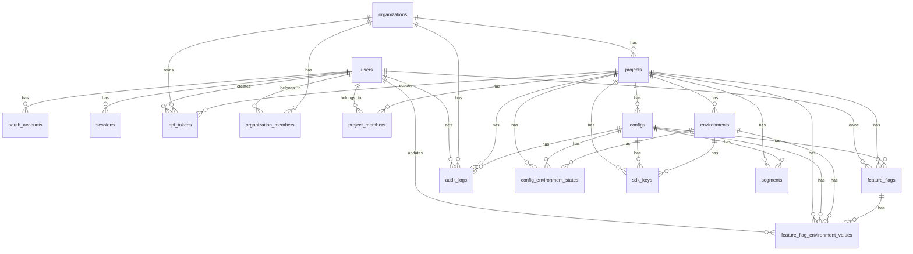

# Data Model - Capture Flag

## Purpose

Document the initial relational model for Capture Flag, its relationships, constraints, and modeling decisions.

This document covers the model needed for the MVP and its current evolution: login, organizations, projects, configs, environments, SDK keys, feature flags/settings, environment-specific values, segments, advanced targeting, publishable config state, and advanced audit logs.

## Implemented State

The initial migration in `apps/api/prisma/migrations/000001_init/migration.sql` covers the foundation. Later migrations include flags, environment-specific values, audit logs, and segments.

| Table | State |
|---|---|
| `users` | Implemented |
| `oauth_accounts` | Implemented |
| `sessions` | Implemented |
| `organizations` | Implemented |
| `organization_members` | Implemented |
| `projects` | Implemented |
| `project_members` | Implemented |
| `configs` | Implemented |
| `environments` | Implemented |
| `config_environment_states` | Implemented |
| `sdk_keys` | Implemented |
| `api_tokens` | Implemented |
| `segments` | Implemented |
| `feature_flags` | Implemented |
| `feature_flag_environment_values` | Implemented |
| `audit_logs` | Implemented as advanced audit |

Validations that `config_id` and `environment_id` belong to the same `project_id` are performed by API services and reinforced by composite constraints added in migration `000002_harden_phase1_constraints`.

## Conventions

| Convention | Decision |
|---|---|
| Naming | Tables and columns in `snake_case` |
| Primary keys | `uuid` in all tables |
| Dates | `created_at` and `updated_at` when the entity is mutable |
| Soft delete | Use specific columns such as `revoked_at`, `accepted_at`, and `deleted_at` when appropriate |
| JSON | Use `jsonb` for rules, percentage rollout, typed values, and audit payloads in the MVP |
| Tenant | Every operational entity must be reachable from an `organization` |
| Secrets | Keys and tokens must be stored as hashes, never in plaintext |
| Advanced targeting | Prerequisites, arrays, dates, and SemVer live in `rules_json`/`conditions_json`; no new table is needed in Phase 7 |

## Model Invariants

These rules are part of the domain model and must be preserved by the API, migrations, and UI.

| Invariant | Implication |
|---|---|
| Every `Project` must have at least one `Config` | When creating a project, the API automatically creates an initial config with `key = default` |
| `Config` is required for flags | `feature_flags.config_id` is always `NOT NULL` |
| `Config` is required for SDK keys | `sdk_keys.config_id` is always `NOT NULL` |
| `Config` is required for publishable state | `config_environment_states.config_id` is always `NOT NULL` |
| The last config in a project cannot be removed in the MVP | Prevents a project with no publishable unit for SDKs |
| The UI can hide Config when there is only one | The model remains explicit without adding complexity for the initial user |
| Boolean flag has no separate `enabled` | The on/off state is the `default_value` itself or the value served by rule/rollout |

## Values And Fallback

There are two different default value concepts.

| Concept | Where it lives | Use |
|---|---|---|
| `default_value` | Database and Config JSON | Value configured in the client for a flag in an environment |
| `fallbackValue` | SDK call | Emergency value provided by the application when the flag cannot be evaluated |

Expected SDK evaluation order:

| Order | Result |
|---|---|
| 1 | Evaluate `rules_json` in order |
| 2 | If no rule matches, evaluate `percentage_options_json` |
| 3 | If rollout does not apply, return `default_value` |
| 4 | If the config is unavailable or invalid, or the flag does not exist, return the `fallbackValue` provided by the application |

Prerequisite flags are conditions inside `rules_json`. They reference another flag by key within the same config and are evaluated locally in the SDK. The API rejects self-references, missing references, and cycles in the saved environment prerequisite graph.

## ERD MVP



## MVP Tables

### users

Represents the primary identity of a user within the platform.

`users` must not be coupled to a specific OAuth provider. The same user can sign in with GitHub in the MVP and link Google in the future.

Email is optional because OAuth providers may not return reliable or public email. The strong identity is in `oauth_accounts(provider, provider_user_id)`.

Account deletion uses soft delete in `users.deleted_at`: the user is retained for historical integrity, but sessions and API tokens are revoked, OAuth accounts are unlinked, memberships are removed, and direct PII in the row (`name`/`email`) is anonymized.

| Column | Type | Required | Note |
|---|---|---|---|
| id | uuid | yes | Primary key |
| name | text | yes | Name displayed in the client |
| email | text | no | Primary email known by the platform |
| deleted_at | timestamp | no | Marked when the account was deleted/anonymized |
| created_at | timestamp | yes | Creation date |
| updated_at | timestamp | yes | Update date |

Constraints and indexes:

| Type | Definition |
|---|---|
| partial unique | `email` where `email is not null` |
| index | `deleted_at` |

### oauth_accounts

Represents a link between a platform user and an external OAuth account.

In the MVP, the first provider will be GitHub. The separation allows adding Google later without remodeling `users`.

| Column | Type | Required | Note |
|---|---|---|---|
| id | uuid | yes | Primary key |
| user_id | uuid | yes | FK to `users.id` |
| provider | text | yes | Example: `github` |
| provider_user_id | text | yes | Stable user ID in the provider |
| provider_email | text | no | Email returned by the provider |
| created_at | timestamp | yes | Creation date |
| updated_at | timestamp | yes | Update date |

Constraints and indexes:

| Type | Definition |
|---|---|
| unique | `(provider, provider_user_id)` |
| index | `user_id` |

### sessions

Represents an opaque session used by the client with an HTTP-only cookie.

The cookie stores the raw token. The database stores only the token hash.

| Column | Type | Required | Note |
|---|---|---|---|
| id | uuid | yes | Primary key |
| user_id | uuid | yes | FK to `users.id` |
| token_hash | text | yes | Session token hash |
| expires_at | timestamp | yes | Session expiration |
| revoked_at | timestamp | no | Manual revocation/logout |
| created_at | timestamp | yes | Creation date |

Constraints and indexes:

| Type | Definition |
|---|---|
| unique | `token_hash` |
| index | `user_id` |
| index | `expires_at` |

### organizations

Represents the platform's primary tenant.

An organization has many users and many projects.

| Column | Type | Required | Note |
|---|---|---|---|
| id | uuid | yes | Primary key |
| name | text | yes | Displayed name |
| slug | text | yes | Unique readable identifier |
| deleted_at | timestamp | no | Organization archival without removing history |
| created_at | timestamp | yes | Creation date |
| updated_at | timestamp | yes | Update date |

Constraints and indexes:

| Type | Definition |
|---|---|
| unique | `slug` |
| index | `deleted_at` |

### organization_members

Represents a user's access to an organization and their organization role.

Organization roles are used for high-level administration: members, projects, and future billing.

| Column | Type | Required | Note |
|---|---|---|---|
| id | uuid | yes | Primary key |
| organization_id | uuid | yes | FK to `organizations.id` |
| user_id | uuid | yes | FK to `users.id` |
| role | text | yes | `owner`, `admin`, `member`, `viewer` |
| created_at | timestamp | yes | Creation date |
| updated_at | timestamp | yes | Update date |

Constraints and indexes:

| Type | Definition |
|---|---|
| unique | `(organization_id, user_id)` |
| index | `user_id` |

### projects

Represents a product, application, or system inside an organization.

Projects are the functional boundary for configs, environments, project members, and specific permissions.

| Column | Type | Required | Note |
|---|---|---|---|
| id | uuid | yes | Primary key |
| organization_id | uuid | yes | FK to `organizations.id` |
| name | text | yes | Displayed name |
| slug | text | yes | Readable identifier within the organization |
| deleted_at | timestamp | no | Project archival without removing history |
| created_at | timestamp | yes | Creation date |
| updated_at | timestamp | yes | Update date |

Constraints and indexes:

| Type | Definition |
|---|---|
| unique | `(organization_id, slug)` |
| auxiliary unique | `(id, organization_id)` for composite FKs when needed |
| index | `(organization_id, deleted_at)` |

### configs

Represents a set of flags/settings consumed as Config JSON by SDKs.

A project can have multiple configs, for example `frontend-web`, `backend-api`, and `mobile-app`. Each `config + environment` pair can have its own SDK key.

When creating a project, the application must create an initial config with `key = default` and `name = Default`. This config can be renamed later, but the last active config in a project must not be removed in the MVP.

| Column | Type | Required | Note |
|---|---|---|---|
| id | uuid | yes | Primary key |
| project_id | uuid | yes | FK to `projects.id` |
| key | text | yes | Identifier used in URLs, SDK keys, and APIs |
| name | text | yes | Displayed name |
| description | text | no | Config description |
| created_at | timestamp | yes | Creation date |
| updated_at | timestamp | yes | Update date |

Constraints and indexes:

| Type | Definition |
|---|---|
| unique | `(project_id, key)` |
| auxiliary unique | `(id, project_id)` for composite FKs |
| index | `project_id` |

### project_members

Represents a user's access to a project and their role in that project.

The same user can have different roles in different projects of the same organization.

| Column | Type | Required | Note |
|---|---|---|---|
| id | uuid | yes | Primary key |
| project_id | uuid | yes | FK to `projects.id` |
| user_id | uuid | yes | FK to `users.id` |
| role | text | yes | `project_admin`, `developer`, `viewer` |
| created_at | timestamp | yes | Creation date |
| updated_at | timestamp | yes | Update date |

Constraints and indexes:

| Type | Definition |
|---|---|
| unique | `(project_id, user_id)` |
| index | `user_id` |

### environments

Represents an environment inside a project.

Examples: `development`, `staging`, `production`.

| Column | Type | Required | Note |
|---|---|---|---|
| id | uuid | yes | Primary key |
| project_id | uuid | yes | FK to `projects.id` |
| name | text | yes | Displayed name |
| key | text | yes | Identifier used internally/API |
| sort_order | integer | yes | Ordering in the client |
| created_at | timestamp | yes | Creation date |
| updated_at | timestamp | yes | Update date |

Constraints and indexes:

| Type | Definition |
|---|---|
| unique | `(project_id, key)` |
| auxiliary unique | `(id, project_id)` for composite FKs |
| index | `project_id` |

### config_environment_states

Represents the current publishable state of a config in an environment.

In the MVP, it does not store full history. It exists to support `revision`, `etag`, and HTTP cache from the beginning.

| Column | Type | Required | Note |
|---|---|---|---|
| id | uuid | yes | Primary key |
| project_id | uuid | yes | FK to `projects.id` |
| config_id | uuid | yes | FK to `configs.id` |
| environment_id | uuid | yes | FK to `environments.id` |
| revision | integer | yes | Sequence for the `config + environment` pair |
| etag | text | yes | Value used in the `ETag` header |
| generated_at | timestamp | yes | When the current JSON was generated/computed |
| created_at | timestamp | yes | Creation date |
| updated_at | timestamp | yes | Update date |

Constraints and indexes:

| Type | Definition |
|---|---|
| unique | `(config_id, environment_id)` |
| index | `(project_id, environment_id)` |
| index | `etag` |

Integrity rule:

| Rule |
|---|
| `config_id` must belong to the same `project_id` |
| `environment_id` must belong to the same `project_id` |
| `revision` starts at 1 and increments on every change that changes the Config JSON |
| `etag` must change when `revision` or public content changes |

### sdk_keys

Represents a public read-only key used by SDKs to download the Config JSON.

`sdk_keys` is in its own table because the key is per config/environment and must support rotation, revocation, multiple active keys, and usage metadata.

| Column | Type | Required | Note |
|---|---|---|---|
| id | uuid | yes | Primary key |
| project_id | uuid | yes | FK to `projects.id`; denormalization for tenant and constraints |
| config_id | uuid | yes | FK to `configs.id` |
| environment_id | uuid | yes | FK to `environments.id` |
| name | text | yes | Displayed name, example: `Frontend Production SDK Key` |
| key_prefix | text | yes | Visible prefix for identification |
| key_hash | text | yes | Full key hash |
| revoked_at | timestamp | no | Key revocation |
| last_used_at | timestamp | no | Last known use |
| created_at | timestamp | yes | Creation date |
| updated_at | timestamp | yes | Update date |

Constraints and indexes:

| Type | Definition |
|---|---|
| unique | `key_hash` |
| unique | `key_prefix` |
| index | `(config_id, environment_id)` |
| index | `(project_id, environment_id)` |

Integrity rule:

| Rule |
|---|
| `config_id` must belong to the same `project_id` as the SDK key |
| `environment_id` must belong to the same `project_id` as the SDK key |
| The raw key must only be displayed at creation time |
| The public Config JSON must return only flags from the SDK key's config and environment |
| A revoked SDK key cannot access the public endpoint |

### api_tokens

Represents a Bearer token used by the Public Management API for external automation.

`api_tokens` follows the same secret rule as sessions and SDK keys: the raw key appears only at creation time. The database stores only a hash and a safe prefix for operational identification.

| Column | Type | Required | Note |
|---|---|---|---|
| id | uuid | yes | Primary key |
| organization_id | uuid | yes | FK to `organizations.id`; required token scope |
| project_id | uuid | no | Optional composite FK to restrict the token to a project in the organization |
| user_id | uuid | yes | Creating user/subject used for effective RBAC |
| name | text | yes | Displayed name for identification |
| token_prefix | text | yes | Visible prefix for support/audit |
| token_hash | text | yes | SHA-256 hash of the full token |
| scopes | text[] | yes | Permissions granted to the token |
| expires_at | timestamp | no | Optional expiration |
| revoked_at | timestamp | no | Manual revocation |
| last_used_at | timestamp | no | Last authenticated use |
| created_at | timestamp | yes | Creation date |
| updated_at | timestamp | yes | Update date |

Constraints and indexes:

| Type | Definition |
|---|---|
| unique | `token_hash` |
| unique | `token_prefix` |
| check | `scopes` limited to scopes supported by API v1 |
| composite FK | `(project_id, organization_id)` references `projects(id, organization_id)` |
| index | `organization_id` |
| index | `project_id` |
| index | `user_id` |
| index | `expires_at` |

Scopes supported in v1:

| Scope |
|---|
| `projects:read` |
| `projects:write` |
| `configs:read` |
| `configs:write` |
| `members:read` |
| `members:write` |
| `flags:read` |
| `flags:write` |
| `environments:read` |
| `segments:read` |
| `segments:write` |

Integrity rule:

| Rule |
|---|
| Raw token must never be stored, logged, or displayed again after creation |
| Revoked or expired token does not authenticate |
| Token with `project_id` only accesses resources in that project |
| Effective permission requires the token tenant, token scope, and current RBAC of `user_id` |
| Authenticated use updates `last_used_at` |

### segments

Represents a reusable group of user conditions within a config.

Segments are emitted in the Config JSON so SDKs can evaluate rules locally without sending Evaluation Context to the API. In Phase 6, segments cannot reference other segments.

| Column | Type | Required | Note |
|---|---|---|---|
| id | uuid | yes | Primary key |
| project_id | uuid | yes | FK to `projects.id`; denormalization for tenant and constraints |
| config_id | uuid | yes | FK to `configs.id` |
| key | text | yes | Identifier used in rules, example `beta-users` |
| name | text | yes | Displayed name |
| description | text | no | Segment description |
| conditions_json | jsonb | yes | List of conditions evaluated with AND |
| deleted_at | timestamp | no | Logical deletion |
| created_at | timestamp | yes | Creation date |
| updated_at | timestamp | yes | Update date |

Constraints and indexes:

| Type | Definition |
|---|---|
| partial unique | `(config_id, key)` only when `deleted_at IS NULL` |
| auxiliary unique | `(id, project_id, config_id)` for future composite FKs |
| index | `(project_id, config_id)` |

Integrity rule:

| Rule |
|---|
| `config_id` must belong to the same `project_id` as the segment |
| `conditions_json` must be a valid array, even when empty |
| Segment conditions use attributes, operators, and values from basic targeting |
| Segments cannot reference other segments in Phase 6 |
| Segment `key` cannot be changed or removed while active rules reference that key |
| Creating, removing, or changing `key`/`conditions_json` changes the public JSON and increments `config_environment_states.revision` for all environments of the config |

### feature_flags

Represents metadata for a feature flag or remote config within a config.

The actual flag value is in `feature_flag_environment_values`, because it varies by environment.

| Column | Type | Required | Note |
|---|---|---|---|
| id | uuid | yes | Primary key |
| project_id | uuid | yes | FK to `projects.id`; denormalization for tenant and constraints |
| config_id | uuid | yes | FK to `configs.id` |
| key | text | yes | Identifier used in code |
| name | text | yes | Displayed name |
| description | text | no | Flag description |
| type | text | yes | `boolean`, `string`, `integer`, `double`, `json_object`, `json_array` |
| initial_default_value | jsonb | no | Initial value used for environments created after the flag |
| tags | text[] | no | Visual organization |
| hint | text | no | Usage help |
| owner_user_id | uuid | no | FK to `users.id` |
| created_at | timestamp | yes | Creation date |
| updated_at | timestamp | yes | Update date |
| deleted_at | timestamp | no | Logical deletion |

Constraints and indexes:

| Type | Definition |
|---|---|
| partial unique | `(config_id, key)` only when `deleted_at IS NULL` |
| auxiliary unique | `(id, project_id, config_id)` for composite FKs |
| index | `(project_id, config_id)` |
| index | `owner_user_id` |

Integrity rule:

| Rule |
|---|
| `config_id` must belong to the same `project_id` as the flag |
| Every flag must belong to a config; `config_id` is never null |
| `initial_default_value`, when provided, must respect the flag `type` |
| `json_object` requires a JSON object as root, and `json_array` requires a JSON array as root |
| `owner_user_id`, when provided, must be validated as a project or organization member |

### feature_flag_environment_values

Represents the value, rules, and rollout of a flag in a specific environment.

This table is the practical relationship between `feature_flags` and `environments`.

| Column | Type | Required | Note |
|---|---|---|---|
| id | uuid | yes | Primary key |
| project_id | uuid | yes | FK to `projects.id`; denormalization for tenant and constraints |
| config_id | uuid | yes | FK to `configs.id` |
| feature_flag_id | uuid | yes | FK to `feature_flags.id` |
| environment_id | uuid | yes | FK to `environments.id` |
| default_value | jsonb | yes | Typed default value according to `feature_flags.type` |
| rules_json | jsonb | yes | Targeting rules in the MVP |
| percentage_attribute | text | yes | Attribute used in rollout, default `identifier` |
| percentage_options_json | jsonb | yes | Percentage rollout in the MVP |
| updated_by_user_id | uuid | no | FK to `users.id` |
| created_at | timestamp | yes | Creation date |
| updated_at | timestamp | yes | Update date |

Constraints and indexes:

| Type | Definition |
|---|---|
| unique | `(feature_flag_id, environment_id)` |
| index | `(config_id, environment_id)` |
| index | `(project_id, environment_id)` |
| index | `updated_by_user_id` |

Integrity rule:

| Rule |
|---|
| `feature_flag_id` must belong to the same `project_id` and `config_id` |
| `environment_id` must belong to the same `project_id` |
| `default_value` must be validated according to `feature_flags.type` |
| Values JSON can appear in `default_value`, `rules_json[*].serve`, and `percentage_options_json[*].value` |
| `rules_json` and `percentage_options_json` must be valid arrays, even when empty |
| When `percentage_options_json` is not empty, percentages must add up to 100 |
| Boolean flags use `default_value` as on/off; there is no separate `enabled` column |
| `default_value` is different from the `fallbackValue` provided by the SDK |
| Every change that changes the public JSON increments `config_environment_states.revision` |
| Every relevant change must automatically generate `audit_logs` |

### audit_logs

Represents immutable history for flags, environment-specific values, SDK keys, API tokens, segments, members, and config publications.

It records important changes automatically through the backend, without requiring mandatory manual fields from the user. Operational reads support filters by actor, entity, period, and project/config scope. Retention and export are left for future phases.

| Column | Type | Required | Note |
|---|---|---|---|
| id | uuid | yes | Primary key |
| organization_id | uuid | yes | FK to `organizations.id` |
| project_id | uuid | no | FK to `projects.id`, when applicable |
| config_id | uuid | no | FK to `configs.id`, when applicable |
| actor_user_id | uuid | no | FK to `users.id`; null for system actions |
| action | text | yes | Example: `flag.created`, `flag_value.updated`, `sdk_key.revoked` |
| entity_type | text | yes | Example: `feature_flag`, `sdk_key`, `environment` |
| entity_id | uuid | yes | ID of the changed entity |
| old_value | jsonb | no | Previous state when applicable |
| new_value | jsonb | no | New state when applicable |
| metadata | jsonb | yes | Auxiliary data, can be `{}` |
| created_at | timestamp | yes | Event date |

Constraints and indexes:

| Type | Definition |
|---|---|
| index | `(organization_id, created_at)` |
| index | `(project_id, created_at)` |
| index | `(config_id, created_at)` |
| index | `(actor_user_id, created_at)` |
| index | `(entity_type, entity_id)` |

Integrity rule:

| Rule |
|---|
| Audit log is append-only; it must not be updated or removed by the application |
| Audit log is generated by the backend from mutation context; it must not require explicit user input to exist |
| Resources with audit history must not be removed by cascade, to preserve the investigation trail |
| Account deletion must preserve audit history, revoke credentials, and anonymize direct user PII |
| `project_id`, when provided, must belong to `organization_id` |
| `config_id`, when provided, must belong to the provided `project_id` |

## Main Relationships

| Relationship | Cardinality | Note |
|---|---|---|
| `users -> oauth_accounts` | 1:N | A user can have many OAuth providers |
| `users -> sessions` | 1:N | A user can have many active sessions |
| `users -> api_tokens` | 1:N | A user creates/represents automation tokens |
| `users -> organizations` | N:N | Via `organization_members` |
| `users -> projects` | N:N | Via `project_members` |
| `organizations -> projects` | 1:N | Projects belong to an organization |
| `organizations -> api_tokens` | 1:N | Tokens always belong to an organization |
| `projects -> api_tokens` | 1:N | Tokens can be restricted to a project |
| `projects -> configs` | 1:N | Configs belong to a project |
| `projects -> environments` | 1:N | Environments belong to a project |
| `configs -> segments` | 1:N | Reusable segments belong to a config |
| `configs -> feature_flags` | 1:N | Flags/settings belong to a config |
| `configs -> config_environment_states` | 1:N | Current publishable state by environment |
| `configs -> sdk_keys` | 1:N | Public keys by config/environment |
| `feature_flags -> environments` | N:N | Via `feature_flag_environment_values` |

## Tenant Isolation

Every operational entity must be validated in the context of an organization.

| Entity | Path to organization |
|---|---|
| `organization_members` | `organization_members.organization_id` |
| `projects` | `projects.organization_id` |
| `configs` | `configs.project_id -> projects.organization_id` |
| `project_members` | `project_members.project_id -> projects.organization_id` |
| `environments` | `environments.project_id -> projects.organization_id` |
| `config_environment_states` | `config_environment_states.project_id -> projects.organization_id` |
| `sdk_keys` | `sdk_keys.project_id -> projects.organization_id` |
| `api_tokens` | `api_tokens.organization_id` and optionally `api_tokens.project_id -> projects.organization_id` |
| `segments` | `segments.project_id -> projects.organization_id` |
| `feature_flags` | `feature_flags.project_id -> projects.organization_id` |
| `feature_flag_environment_values` | `feature_flag_environment_values.project_id -> projects.organization_id` |
| `audit_logs` | `audit_logs.organization_id` |

Rules:

| Rule |
|---|
| No private route should fetch a resource only by global ID without validating tenant |
| User must be an `organization_member` before accessing any project in the organization |
| To modify project resources, user must have the appropriate role in `project_members` or organization role `owner`/`admin` |
| Public SDK key does not grant access to the whole database; it only resolves one config and one environment |
| API token does not replace RBAC; it restricts tenant/scopes and still uses the subject user for effective permissions |

## Roles And Permissions

### Organization roles

| Role | Use |
|---|---|
| owner | Full access to organization, members, projects, and future billing |
| admin | Manages organization members and projects, except creating, changing, or removing owners |
| member | Accesses projects where they received a role |
| viewer | Basic organization read access |

### Project roles

| Role | Use |
|---|---|
| project_admin | Manages project members, configs, environments, SDK keys, segments, and flags |
| developer | Creates, edits, and removes project flags |
| viewer | Read-only access to the project |

### Permission examples

| Action | Suggested minimum role |
|---|---|
| Create project | `organization admin` or `organization owner` |
| Add existing member in the organization | `organization admin` or `organization owner` |
| Grant role in project | `project_admin`, `organization admin`, or `organization owner` |
| Create config | `project_admin` |
| Manage SDK keys | `project_admin` |
| Manage environments | `project_admin` |
| Create/edit/remove segment | `project_admin`, `organization admin`, or `organization owner` |
| Create flag | `developer`, `project_admin`, `organization admin`, or `organization owner` |
| Edit flag | `developer`, `project_admin`, `organization admin`, or `organization owner` |
| Remove flag | `developer`, `project_admin`, `organization admin`, or `organization owner` |

## Initial JSON

### Public Config JSON

Simplified example of the artifact downloaded by the SDK:

```json
{
  "schemaVersion": 1,
  "projectKey": "ecommerce",
  "configKey": "frontend-web",
  "environment": "production",
  "revision": 42,
  "generatedAt": "2026-05-12T00:00:00.000Z",
  "segments": {},
  "flags": {
    "newCheckout": {
      "type": "boolean",
      "defaultValue": false,
      "rules": [],
      "percentageAttribute": "identifier",
      "percentageOptions": []
    }
  }
}
```

The `ETag` must be returned as an HTTP header; it does not need to appear in the JSON.

### rules_json

In the MVP, targeting rules are stored as JSONB inside `feature_flag_environment_values`.

Each rule has a list of `conditions`. Conditions inside the same rule use AND. OR is represented by multiple rules evaluated top-down.

Example:

```json
[
  {
    "conditions": [
      {
        "attribute": "country",
        "operator": "equals",
        "value": "BR"
      }
    ],
    "serve": true
  }
]
```

### percentage_attribute

`percentage_attribute` defines which evaluation context attribute enters the deterministic rollout hash.

Default value:

```json
"identifier"
```

### percentage_options_json

In the MVP, percentage rollout is stored as JSONB inside `feature_flag_environment_values`.

Example:

```json
[
  { "percentage": 20, "value": true },
  { "percentage": 80, "value": false }
]
```

## Future Tables

| Table | Phase | Reason |
|---|---|---|
| targeting_rules | Phase 3+ | Normalize only if the UI or queries require it |
| percentage_options | Phase 3+ | Normalize only if the UI or analytics require it |
| organization_invitations | Post-MVP | Email invitations are outside the current implemented model |
| webhooks | Removed from MVP | External integrations |
